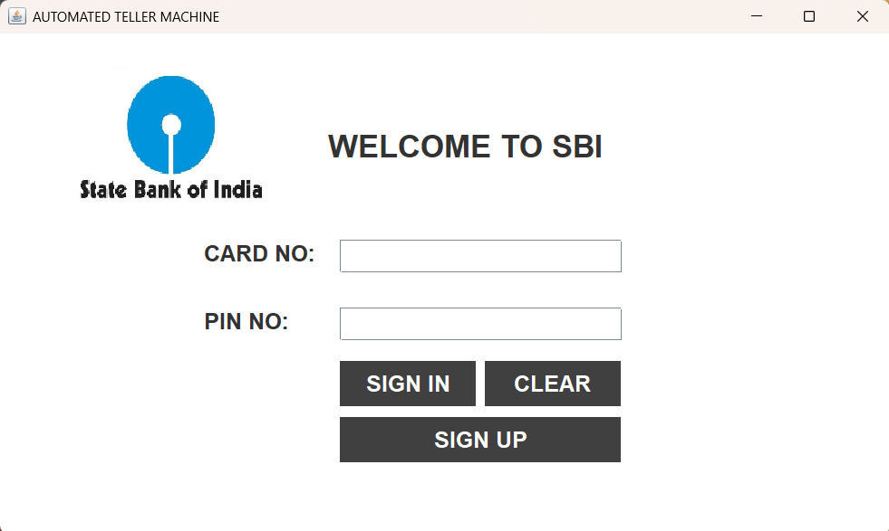
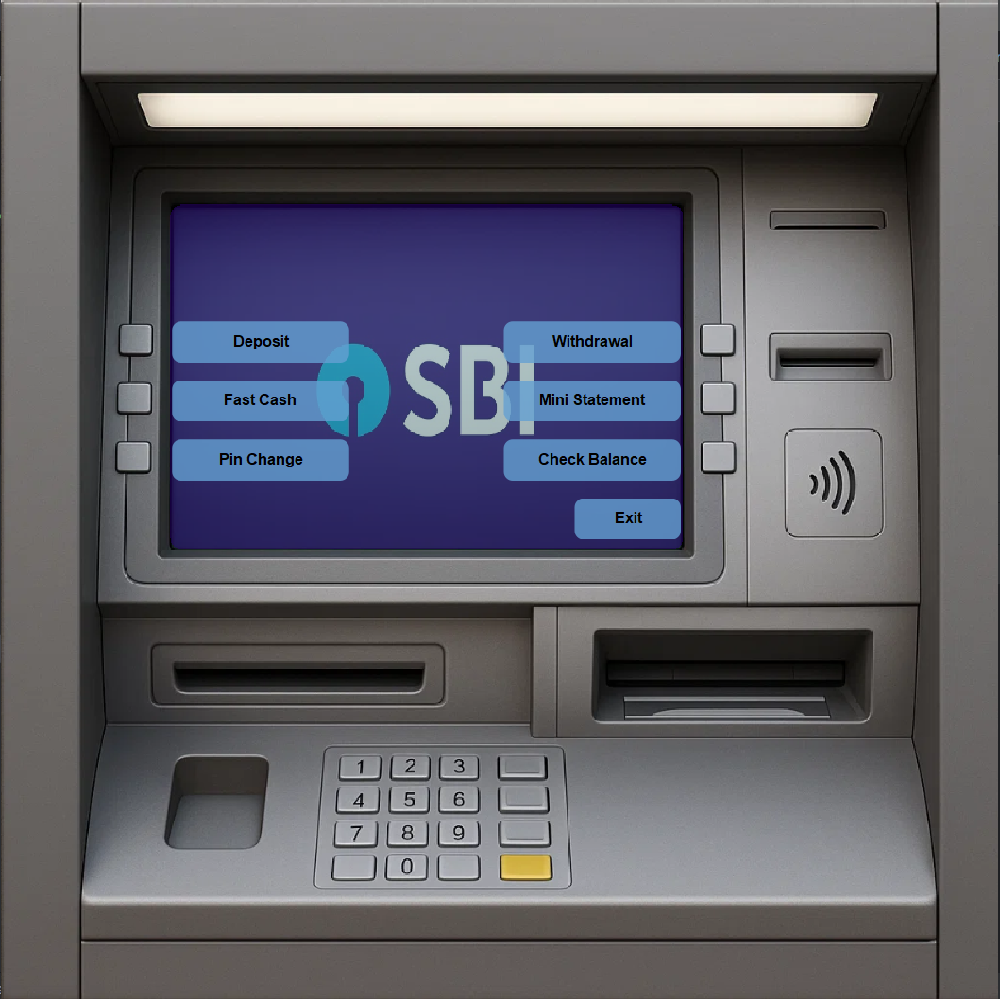
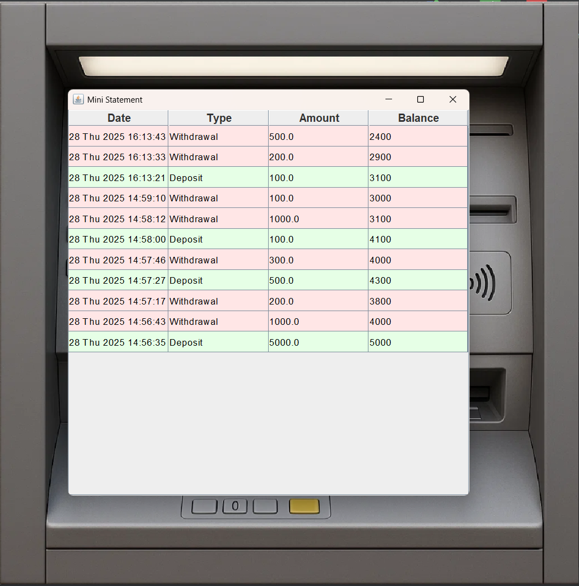

# 🏦 Bank Management System

A **Java Swing-based Banking System** that simulates basic ATM functionalities such as account creation, deposits, withdrawals, balance inquiry, and mini statements.

---

## 🚀 Features
- 🔑 **User Registration & Login**
- 💵 **Deposit & Withdrawal** transactions
- 💳 **Balance Inquiry**
- 📜 **Mini Statement (last 15 transactions)**
- ⚡ **Fast Cash Option**
- 🔒 **PIN Change**
- 🎨 **User-friendly GUI** with SBI-themed background

---

## 🛠️ Tech Stack
- **Java (JDK 21)** – Core logic & GUI (Swing, AWT)
- **MySQL** – Database for storing accounts & transactions
- **JDBC** – Database connectivity
- **IntelliJ IDEA** – IDE used for development
- **Git & GitHub** – Version control

---

## 📂 Project Structure
```
Bank-Management-System/
 ├── src/bankAtm/        # Java source files
 │   ├── Conn.java
 │   ├── Login.java
 │   ├── Signup.java
 │   ├── Deposit.java
 │   ├── Withdrawal.java
 │   ├── MiniStatement.java
 │   ├── Transcation.java
 │   └── ...
 ├── lib/                # External libraries (mysql-connector, jcalendar)
 ├── icons/              # Images (SBI logo, ATM backgrounds, etc.)
 ├── screenshots/        # App screenshots
 ├── database/           # SQL scripts (tables, schema)
 └── README.md
```

---

## ⚡ How to Run

1. **Clone the repo**
   ```bash
   git clone https://github.com/your-username/Bank-Management-System.git
   cd Bank-Management-System
   ```

2. **Import into IntelliJ IDEA / Eclipse**

3. **Set up the Database**
    - Create database:
      ```sql
      CREATE DATABASE bankmanagementsystem;
      ```
    - Import SQL scripts (for `signup`, `signupthree`, `transactions`, etc.).

4. **Configure Database Connection**
    - Update `Conn.java` with your MySQL username & password OR configure environment variables if you moved to an env-based approach.

5. **Run the Project**
    - Run `Login.java` to launch the ATM GUI.

---

## 📝 Notes & Tips
- Put images used by the UI under `src/bankAtm/icons/` and load them with `getResource("/bankAtm/icons/your-image.jpg")` so they work in the JAR.
- Use `PreparedStatement` and `try-with-resources` to avoid SQL injection and resource leaks.
- Store PINs as hashed values (e.g., BCrypt) rather than plaintext. Update DB column size accordingly (e.g., `VARCHAR(60)` for BCrypt).
- Fix typos in class names (`SignPhase0ne` → `SignPhaseOne`, `Transcation` → `Transaction`) for clarity.

---

## 📸 Screenshots
### 🔑 Login Screen


### 🏧 ATM Interface


### 📄 Mini Statement



---

## 👨‍💻 Author
Sudheer Tantapureddy

---